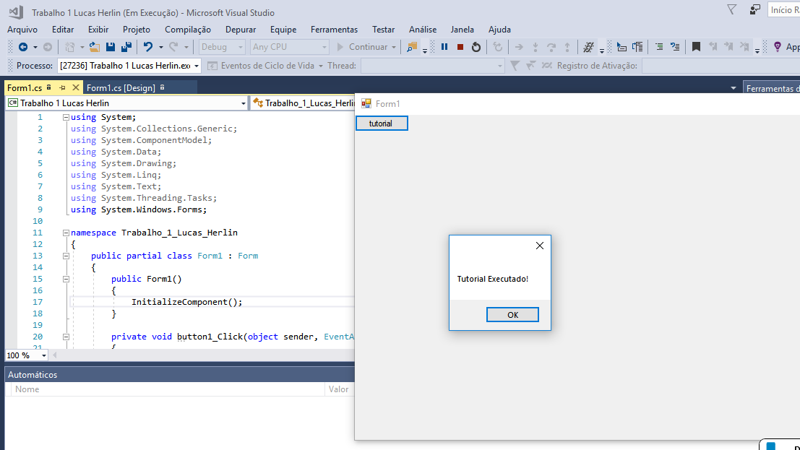

O programa será para acionar um banco de capacitores, ligando-o no horário indutivo e desligando-o no período capacitivo para ajustar a potência reativa de modo a economizar energia elétrica e assim reduzir o valor gasto com luz. 

Ele vai recolher as informações do usuário sobre o gasto de energia nos últimos meses e vai calcular o valor necessário da capacitância do banco para corrigir o fator de potência para 0,95(Valor mínimo recomendado) 

A biblioteca escolhida foi do Windows Forms
Para executar o tutorial entrei no seguinte link:
http://csharp.net-informations.com/gui/gui_tutorial.htm
Com ele aprendi a criar meu arquivo e adicionar um controle (botão) ao projeto. 
Em seguida, na mesma página, aprendi a usar o botão através do link:
http://csharp.net-informations.com/gui/button.htm
Aprendi a trocar o texto do botão, substitui por "tutorial" e adicionei no código um manipulador de eventos simples:
MessageBox.Show("Tutorial Realizado");

Com ele, pude ver a mensagem na tela a mensagem: Tutorial Realizado e conclui a execução de um primeiro programa bem simples para conhecer essa nova ferramenta.

