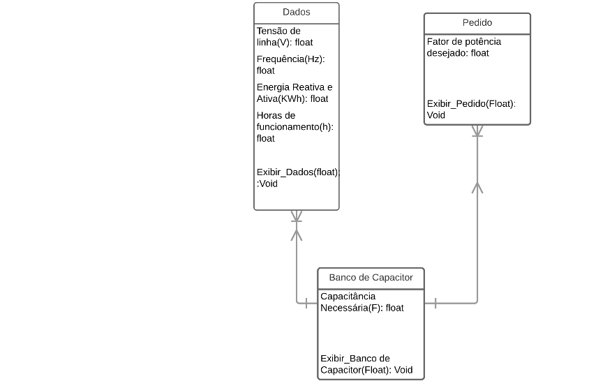

FUNÇÃO:
O programa será para acionar um banco de capacitores, ligando-o no horário indutivo e desligando-o no período capacitivo e calculando o valor da capacitância necessária para chegar no fator de potência necessário.

MOTIVAÇÃO:
Ajustar a potência reativa de modo a economizar energia elétrica e assim reduzir o valor gasto com luz. 

FUNCIONAMENTO:
Ele vai recolher as informações do usuário sobre o gasto de energia nos últimos meses e vai calcular o valor necessário da capacitância equivalente do banco para corrigir o fator de potência para um valor maior que 0,95(Valor mínimo recomendado) 

FLUXOGRAMA:

DIAGRAMA DE CLASSES:

TUTORIAL:
A biblioteca escolhida foi do Windows Forms
Para executar o tutorial entrei no seguinte link:
http://csharp.net-informations.com/gui/gui_tutorial.htm
Com ele aprendi a criar meu arquivo e adicionar um controle (botão) ao projeto. 
Em seguida, na mesma página, aprendi a usar o botão através do link:
http://csharp.net-informations.com/gui/button.htm
Aprendi a trocar o texto do botão, substitui por "tutorial" e adicionei no código um manipulador de eventos simples:
MessageBox.Show("Tutorial Realizado");

Com ele, pude ver a mensagem na tela a mensagem: Tutorial Realizado e conclui a execução de um primeiro programa bem simples para conhecer essa nova ferramenta.

DESCRIÇÃO DA COMPLIÇÃO:
O programa foi feito e compilado utilizando o Windows Forms no Visual Studios 2017 na linguagem C#. Portanto, é necessário baixar o pacote para compilar e executar o programa. Foi criado um executável para executar o programa.  

DESCRIÇÃO DO USO DO PROGRAMA:

Ao iniciar o programa pelo executável, abre-se uma janela com 6 campos editáveis(Horário de Funcionamento(h), Tensão de Linha(V), Frequência(Hz), Média de Potência Ativa(KW), Média de Potência Reativa(KW), Fator de potência necessário). 
É necessário preencher todos os dados para que a capacitância equivalente necessária seja calculada. Caso o horário de funcionamento seja menor do que 6, ela não é calculada, pois é o período capacitivo no qual não é recomendado que se ligue o banco de capacitores. Caso esse horário seja maior ou igual a 6, preenchendo todos os dados(O fator de potência é com vírgula e não ponto), a capacitância necessária para o banco é calculada e indicada para o usuário. 

